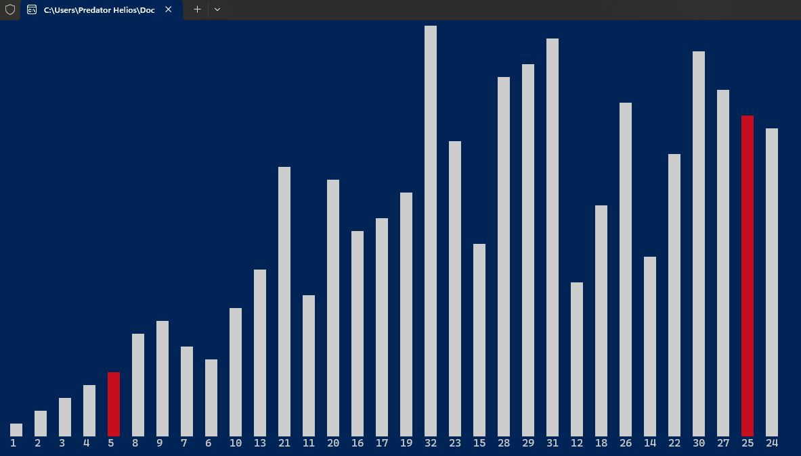
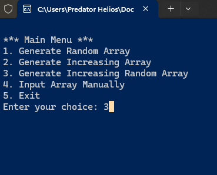
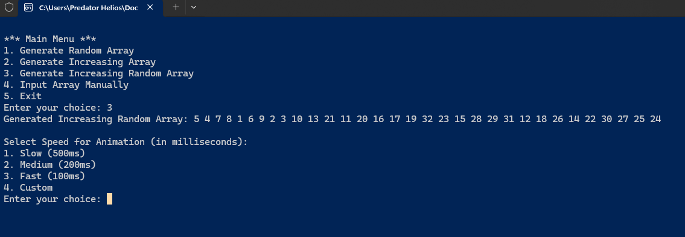
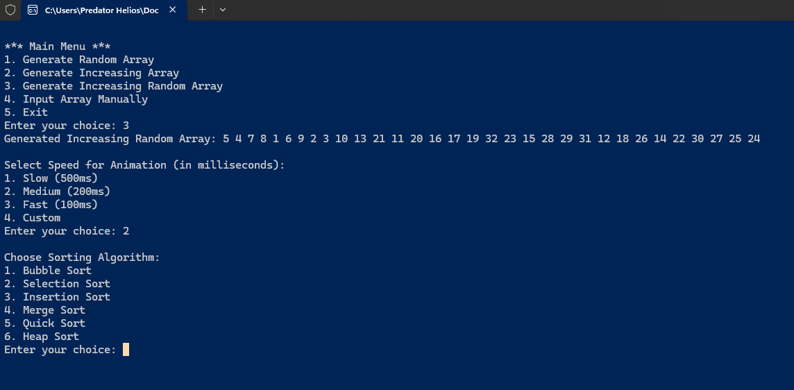
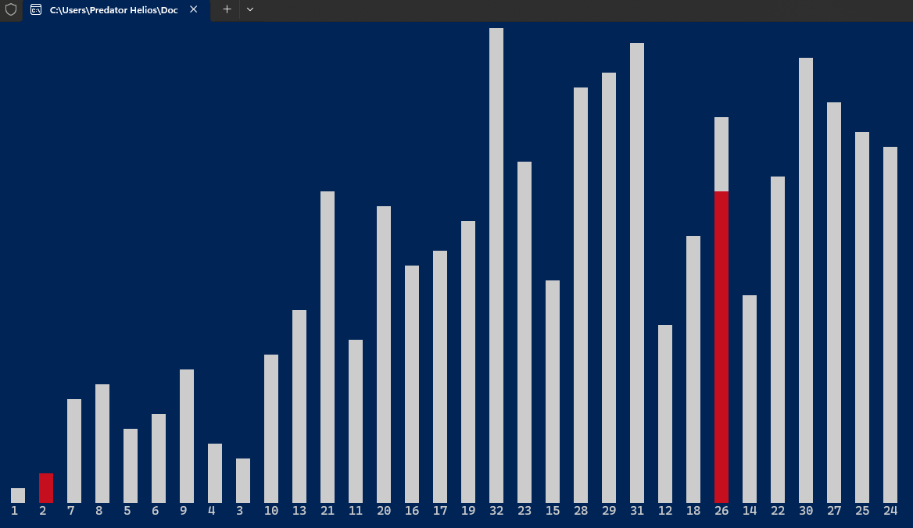

## 🎨 **Sorting Visualizer in C++** 🚀

This is a **Sorting Visualizer** program that shows how different sorting algorithms work, using colorful bars in the console! 📊✨

### Key Features:
- **Visualize Sorting Algorithms** 🧑‍💻: Watch as algorithms like **Bubble Sort**, **Quick Sort**, **Merge Sort**, and more sort the array in real-time! 🔄
- **Interactive** 🎮: Choose your algorithm and adjust the speed to see the magic happen! ⚡
- **Customizable Array** 🛠️: Input your own array or generate random ones for testing! 🎲
- **Speed Control** 🏎️: Set the animation speed from slow to fast to match your pace! ⏱️
- **Histogram Style** 📊: The array is represented as bars, making it easy to track how elements move during sorting. 

# Follow Me on LinkedIn


Connect with me on [LinkedIn](https://www.linkedin.com/in/utkarssharma/) to stay updated on my latest projects and posts! 🚀

⭐ Stars are appreciated! ⭐

If you find my project useful, please give it a star on GitHub to show your support. It helps me a lot and keeps me motivated!

Thank you! 😊

## How to Use:
1. Compile the code using a C++ compiler that supports C++11 or later.
2. Run the program, and choose the sorting algorithm you wish to visualize.
3. You can either input your own array or generate a random array.
4. The visualizer will display the sorting process step by step.

## Demo:

Here's a preview of the sorting visualizer in action:



## Screenshot:





## How It Works:

The visualizer works by dynamically updating the console with the current state of the array being sorted. The histogram shows a bar representation of the array, and elements that are being compared or swapped are highlighted.

## Features

- **Interactive Visualization**: The visualizer shows the sorting process step-by-step with a histogram-like display.
- **Multiple Sorting Algorithms**: You can choose from a variety of sorting algorithms:
  - Bubble Sort
  - Selection Sort
  - Insertion Sort
  - Merge Sort
  - Quick Sort
  - Heap Sort
- **Customizable Animation Speed**: You can choose from predefined speed settings or set a custom speed for the sorting animation.

## Sorting Algorithms

Here are the sorting algorithms implemented:

### 1. **Bubble Sort**
   - **Description**: Compares adjacent elements and swaps them if they are in the wrong order. The process is repeated until the array is sorted.
   - **Visualization**: The bars representing array elements are compared pair by pair, with the larger element "bubbling" to the end.

### 2. **Selection Sort**
   - **Description**: Finds the smallest (or largest) element in the unsorted part of the array and swaps it with the element at the beginning (or end).
   - **Visualization**: The algorithm selects the smallest element and moves it to the correct position, highlighting the current comparison and swap.

### 3. **Insertion Sort**
   - **Description**: Builds the sorted array one element at a time by picking elements from the unsorted part and inserting them into the correct position in the sorted part.
   - **Visualization**: The array is visualized as the elements "inserting" themselves into the correct place.

### 4. **Merge Sort**
   - **Description**: A divide-and-conquer algorithm that splits the array into halves, recursively sorts them, and merges the sorted halves.
   - **Visualization**: The visualization shows the array being split and then merged, with comparisons happening as the halves are merged.

### 5. **Quick Sort**
   - **Description**: Another divide-and-conquer algorithm that picks a pivot element, partitions the array around the pivot, and recursively sorts the subarrays.
   - **Visualization**: The pivot element is chosen, and elements are compared to it, with bars being rearranged based on the partitioning process.

### 6. **Heap Sort**
   - **Description**: Builds a heap (a binary tree) from the array and then extracts the maximum element from the heap one by one, placing it in its correct position.
   - **Visualization**: The heap structure is visualized during the process of sorting.

## Requirements

- **C++ Compiler**: You need a C++ compiler that supports C++11 or later (such as GCC, Clang, or MSVC).
- **Windows**: Since the program uses Windows-specific libraries for console manipulation (`SetConsoleCursorPosition`, `SetConsoleTextAttribute`, etc.), it is designed to work on Windows environments. It may require modifications for other operating systems.

## Compilation and Running

### Step 1: Clone the repository
```bash
git clone https://github.com/utkarshofficial/sorting-visualizer.git
cd sorting-visualizer
